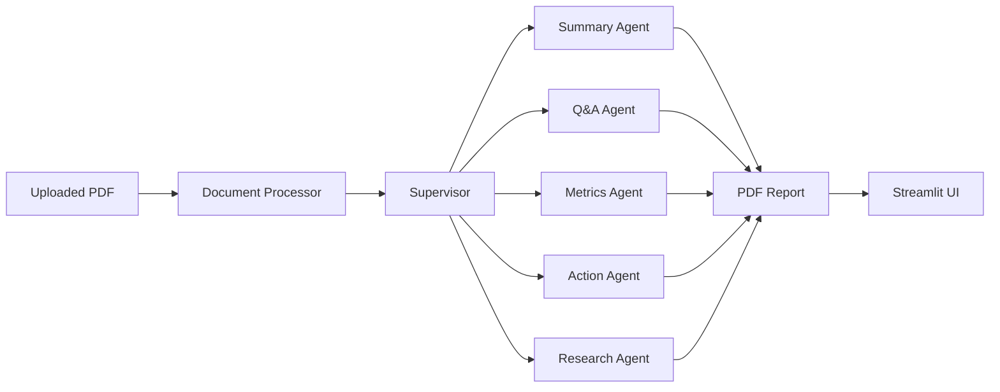
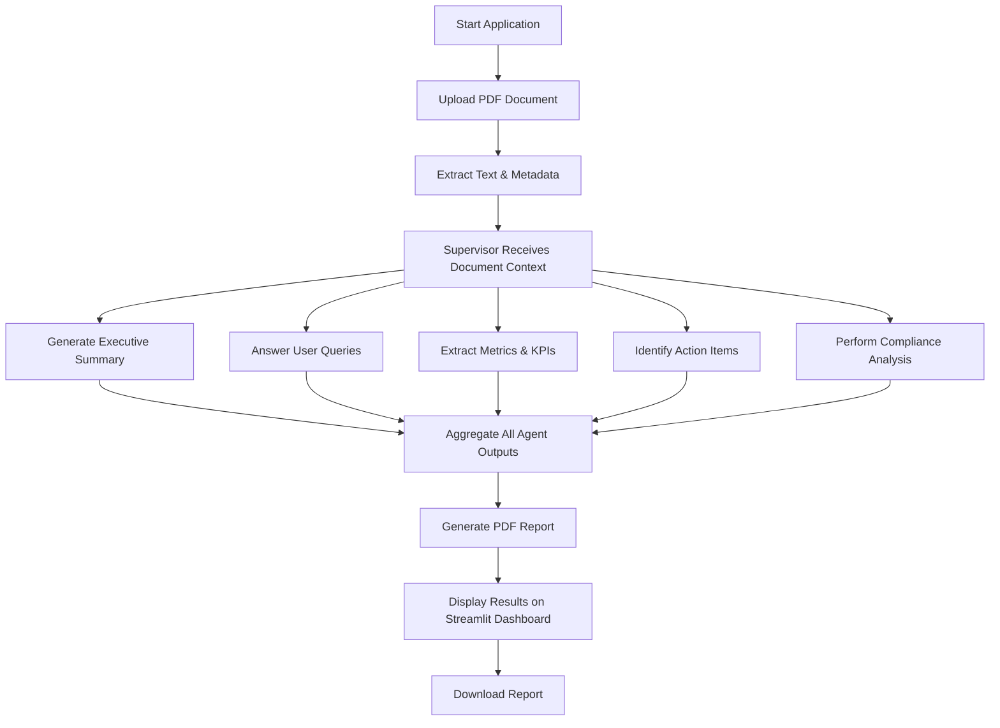

# AI PDF Assistant

## Executive Overview

AI PDF Assistant is an intelligent multi-agent document analysis application that extracts structured information from uploaded PDF files. It generates executive summaries, answers user questions, extracts key metrics, identifies action items, performs compliance analysis, and produces a comprehensive downloadable PDF report.

The application utilizes LangChain for agent orchestration, Hugging Face Serverless API powered by Qwen 2.5 for reasoning, pdfplumber for document extraction, and Streamlit for an interactive web interface.

---

# Folder Structure

```text
AI-PDF-Assistant/
│
├── agents/
│   ├── doc_processor_agent.py
│   ├── summary_agent.py
│   ├── qa_agent.py
│   ├── metrics_agent.py
│   ├── action_agent.py
│   └── research_agent.py
│
├── supervisor/
│   ├── intelligent_supervisor.py
│   └── doc_supervisor.py
│
├── utils/
│   └── pdf_generator.py
│
├── assets/
├── reports/
│
├── app_v2.py
├── requirements.txt
├── .env
├── .gitignore
└── README.md
```

---

# System Architecture

## Multi-Agent Pipeline




---

# Core Components

## 1. Document Processor Agent

### Responsibilities

* Extract document text using pdfplumber
* Read page-wise metadata
* Clean extracted content
* Prepare document context for downstream agents

---

## 2. Summary Agent

### Responsibilities

* Generate executive summaries
* Identify major document sections
* Produce concise overviews

---

## 3. Q&A Agent

### Responsibilities

* Answer user-defined natural language queries
* Retrieve relevant document context
* Generate contextual responses

---

## 4. Metrics Agent

### Responsibilities

* Extract financial metrics
* Detect KPIs
* Identify important statistics
* Parse numerical information

---

## 5. Action Agent

### Responsibilities

* Detect action items
* Identify responsibilities
* Extract deadlines
* Find project milestones

---

## 6. Research Agent

### Responsibilities

* Analyze compliance requirements
* Explain technical terminology
* Identify operational risks
* Generate research insights

---

## 7. Supervisor

### Responsibilities

* Coordinate all AI agents
* Execute the analysis workflow
* Aggregate agent outputs
* Manage document processing

---

## 8. PDF Report Generator

### Responsibilities

* Generate formatted PDF reports
* Combine outputs from all agents
* Export downloadable reports

---

## 9. Streamlit Dashboard

### Responsibilities

* Upload PDF documents
* Display analysis results
* Preview extracted insights
* Download generated reports

---

# Application Workflow

# Application Workflow




---

# Tech Stack

* Python
* Streamlit
* LangChain
* Hugging Face Serverless API
* Qwen 2.5
* pdfplumber
* ReportLab
* python-dotenv

---

# Installation

Clone the repository

```bash
git clone https://github.com/your-username/AI-PDF-Assistant.git
```

Move into the project directory

```bash
cd AI-PDF-Assistant
```

Install the required packages

```bash
pip install -r requirements.txt
```

---

# Environment Setup

Create a `.env` file in the project root.

```text
HUGGINGFACEHUB_API_TOKEN=hf_your_token_here
```

---

# Running the Application

Start the Streamlit application.

```bash
streamlit run app_v2.py
```

---

# Author

**Project:** AI PDF Assistant

**Category:** Artificial Intelligence | Multi-Agent Systems | Document Intelligence

**Language:** Python
